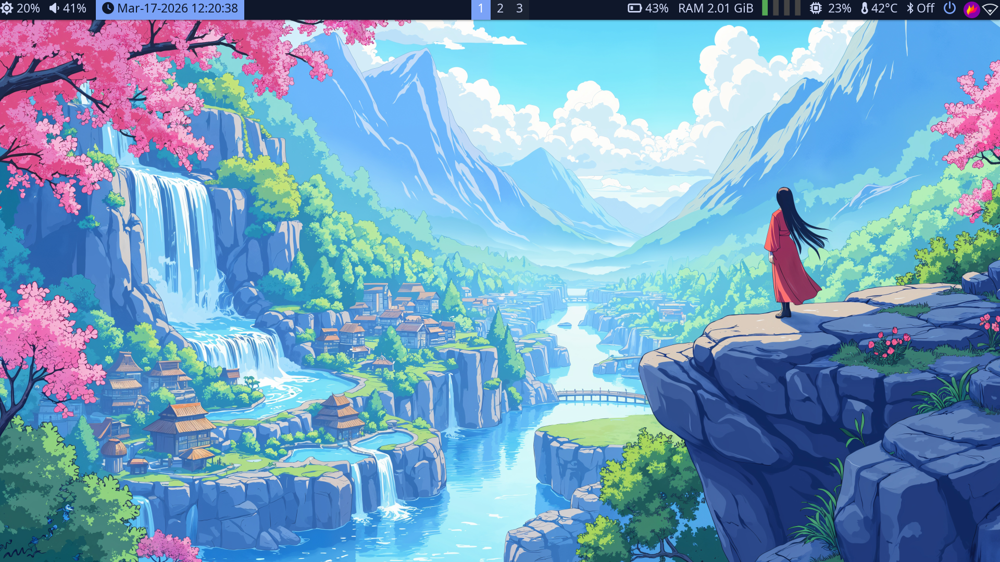

# sakura-i3-minimal
Minimal and aesthetic i3wm setup with Polybar on EndeavourOS.
# 🌸 Sakura i3 Rice (EndeavourOS)

A clean and minimal i3wm setup with Polybar, inspired by simplicity and aesthetic balance.

## 📸 Preview



## ✨ Features

* Clean i3wm layout
* Minimal Polybar
* Smooth transparency (picom)
* Lightweight and fast
* Aesthetic anime wallpaper setup

## ⚙️ Requirements

Install dependencies:

```bash
sudo pacman -S i3-wm polybar rofi picom feh brightnessctl
```

## 🔤 Fonts

Make sure you have:

* Source Code Pro
* Font Awesome
* DejaVu Sans

## 🚀 Installation

```bash
git clone https://github.com/YOUR-USERNAME/REPO-NAME.git
cd REPO-NAME
cp -r .config/* ~/.config/
```

## ⚠️ Notes

* Change network interface if needed (`wlan0`, etc)
* Adjust monitor name if required
* Some modules may need customization per device

## ❤️ Credits

Inspired by r/unixporn
